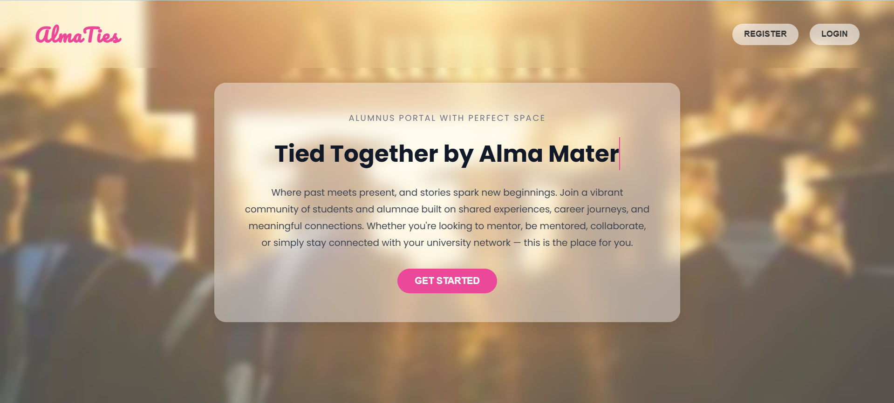
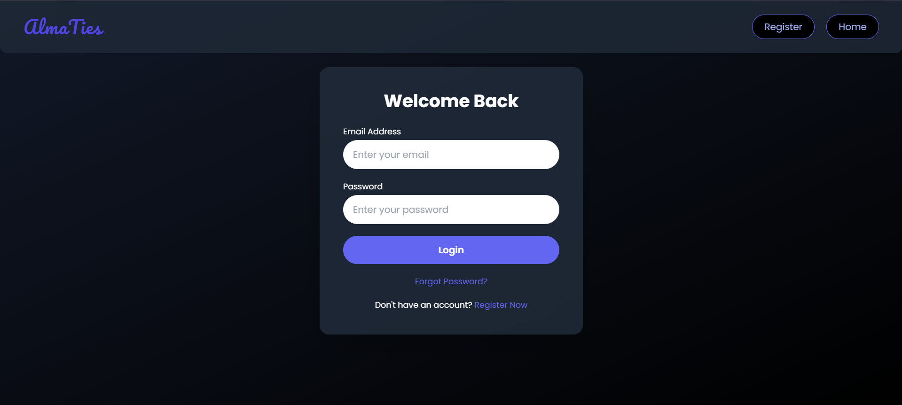
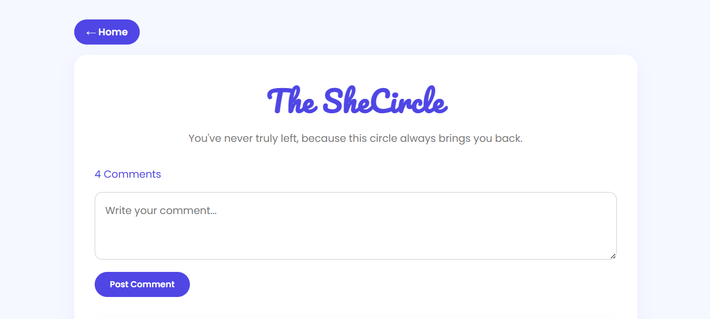
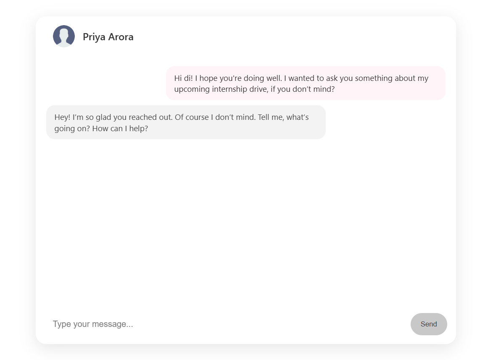
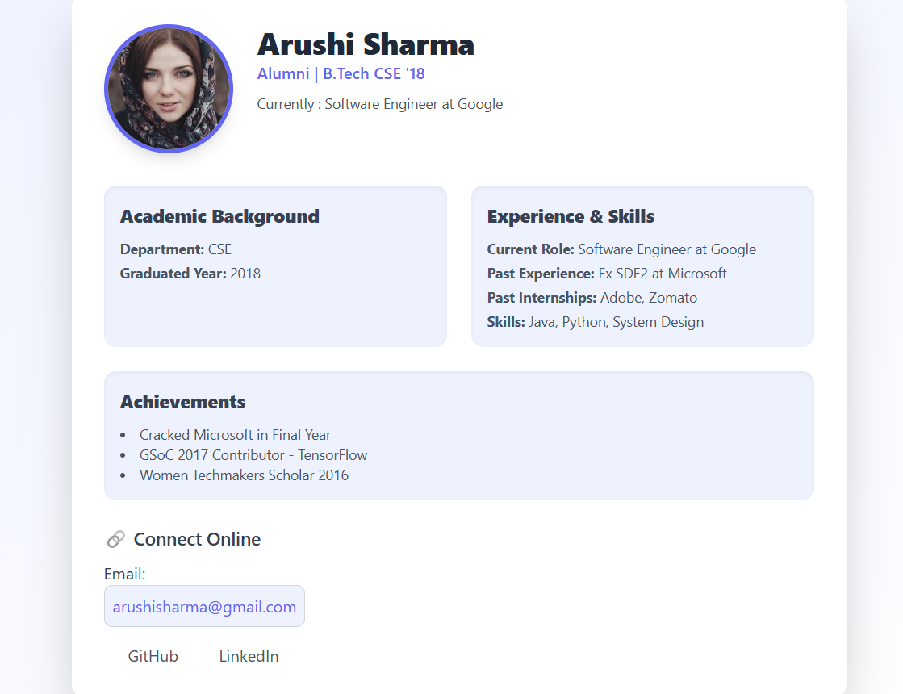
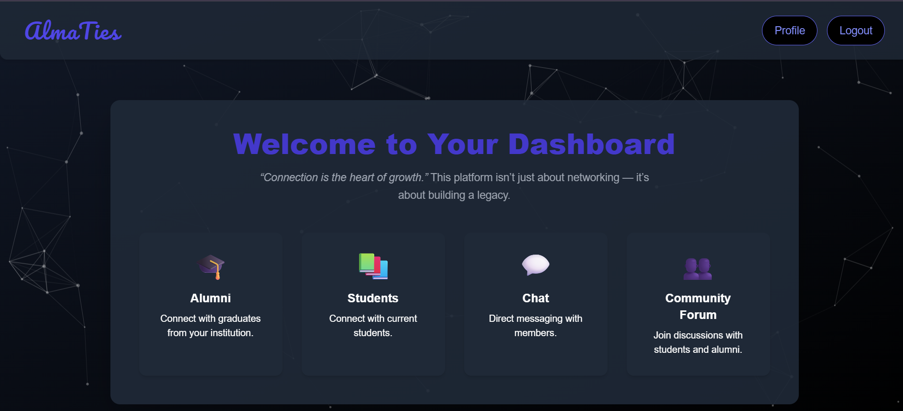
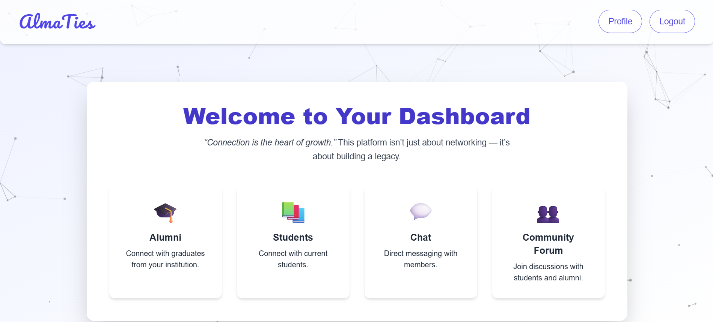

# AlmaTies

**AlmaTies** is a thoughtfully crafted alumni community platform designed to foster lasting bonds that extend far beyond the campus walls. With a clean, minimal, and intuitive interface, it offers a welcoming space for connection, mentorship, and meaningful engagement — all under one cohesive visual identity.

---

## 🌐 Overview

**AlmaTies** serves as a digital bridge between **students and alumni**, empowering both groups through interactive features and open community access.

### 👨‍🎓 For Students:
- Discover and connect with inspiring alumni
- Seek mentorship and career advice
- Engage in forum discussions and ask questions

### 🎓 For Alumni:
- Reconnect with fellow graduates
- Share industry insights and personal stories
- Participate in community mentorship and guidance

---

## 🚀 Key Features

### 🧑‍🤝‍🧑 Community Forum  
A central space for open discussions, storytelling, and Q&A.  

### 💬 One-on-One Chat  
Private, meaningful conversations between students and alumni for focused, personal guidance.  

### 👥 Profile Cards  
Visually appealing student and alumni cards help users discover, explore, and connect.  
- Profiles  
  
- 

### 🌓 Light/Dark Mode Toggle  
Offers both light and dark themes for a comfortable user experience in any setting.
  

---

## 🤝 Why AlmaTies?

Because the college journey doesn’t end with graduation — it transforms. AlmaTies ensures that every bond made during those formative years has the space to grow, thrive, and give back.

> *Reconnect. Reflect. Rise — together.*

---
