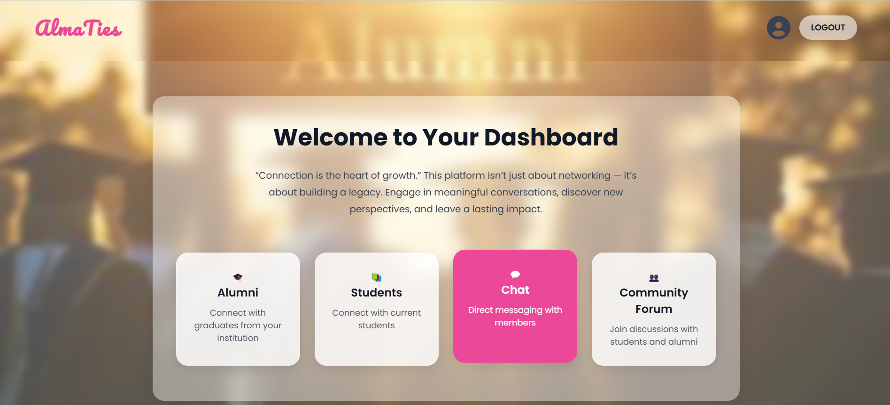
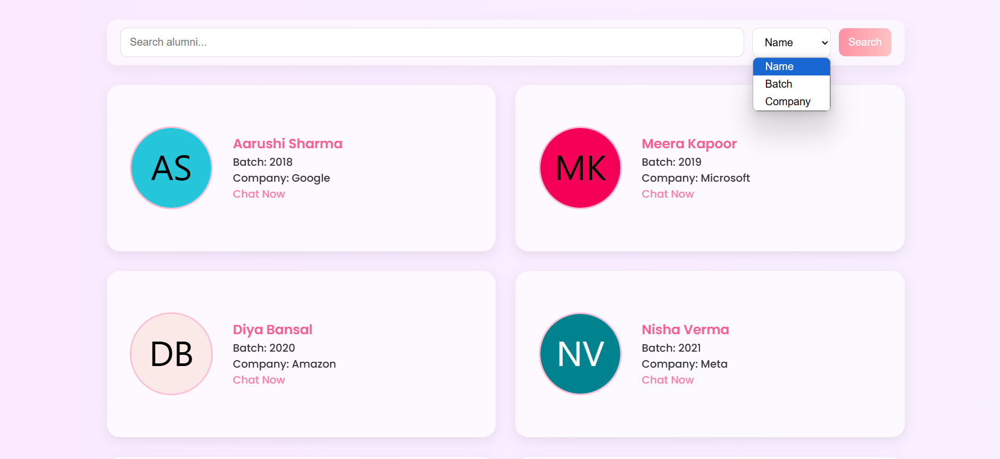
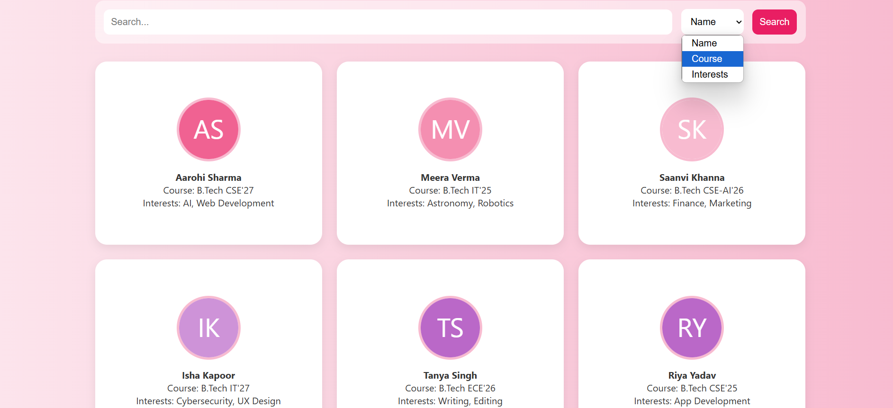

# 🌟 AlmaTies

**AlmaTies** is a thoughtfully crafted alumni community forum designed to foster lasting connections that extend far beyond the campus. With a clean, minimal, and cohesive interface, it creates a welcoming space for discussions, nostalgia, mentorship, and meaningful engagement — all under a unified visual identity.

---

## ✨ Overview

**AlmaTies** acts as a digital bridge between students and alumni, empowering both groups in unique and impactful ways.

### 🎓 For Alumni:
- Reconnect with fellow graduates  
- Engage in thoughtful, topic-based discussions  
- Celebrate shared memories, milestones, and achievements  

### 📚 For Students:
- Build meaningful connections with alumni  
- Seek mentorship and valuable career guidance  
- Discover opportunities, insights, and real-world experiences  

---

## 🔧 Key Features

- 💬 **One-on-One Chat**  
  Private conversations for personalized connections  
  

- 🧾 **Profile Cards**  
  Discover and connect through curated student & alumni profiles  
  
  

- 🌐 **Community Forum**  
  A dedicated space for open discussion, questions, and stories  
  

- 🎨 **Elegant, Minimal UI**  
  A distraction-free design that enhances user experience  

---

## 🤝 Why AlmaTies?

Because the college journey doesn’t end with graduation — it evolves. AlmaTies ensures that every connection made in those hallways can grow, thrive, and inspire long after the last class.

